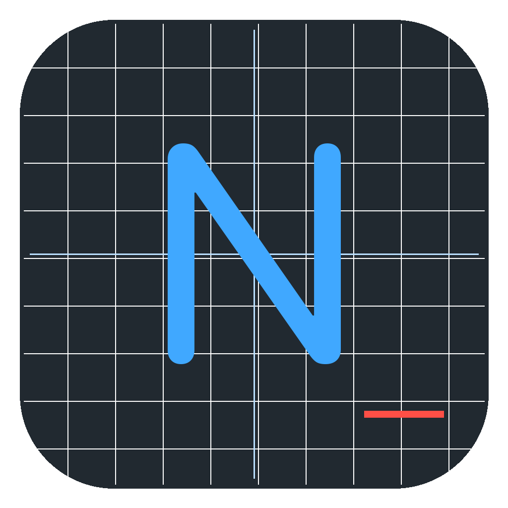
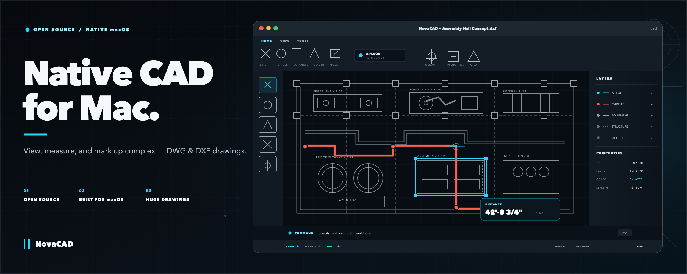
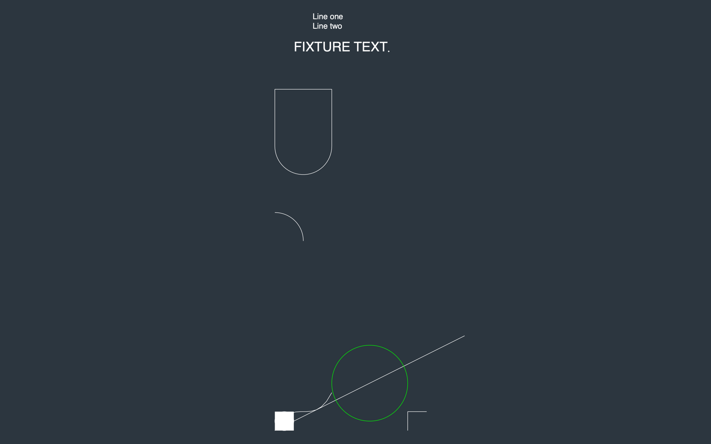
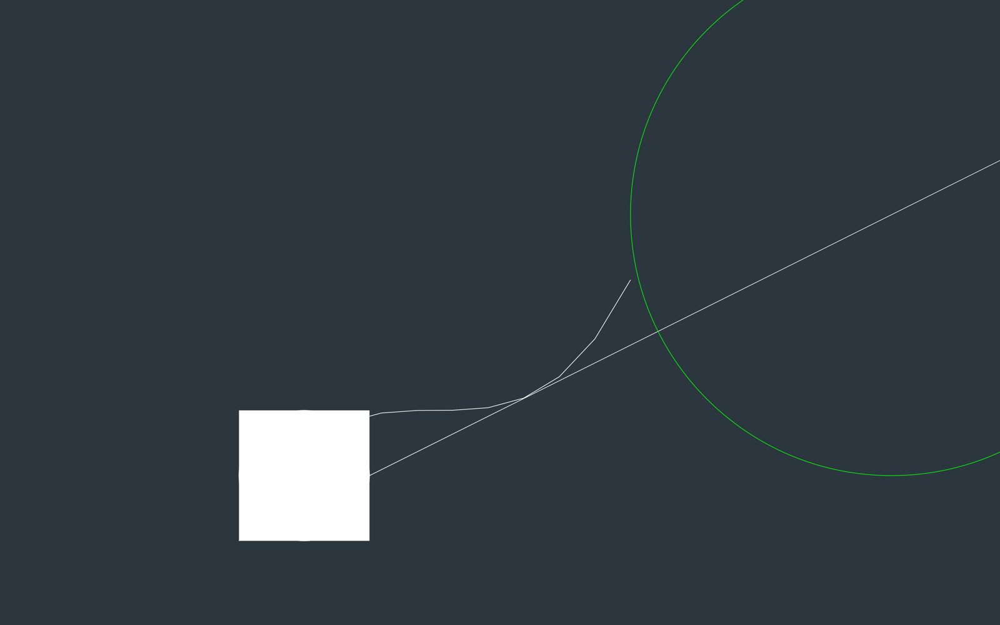
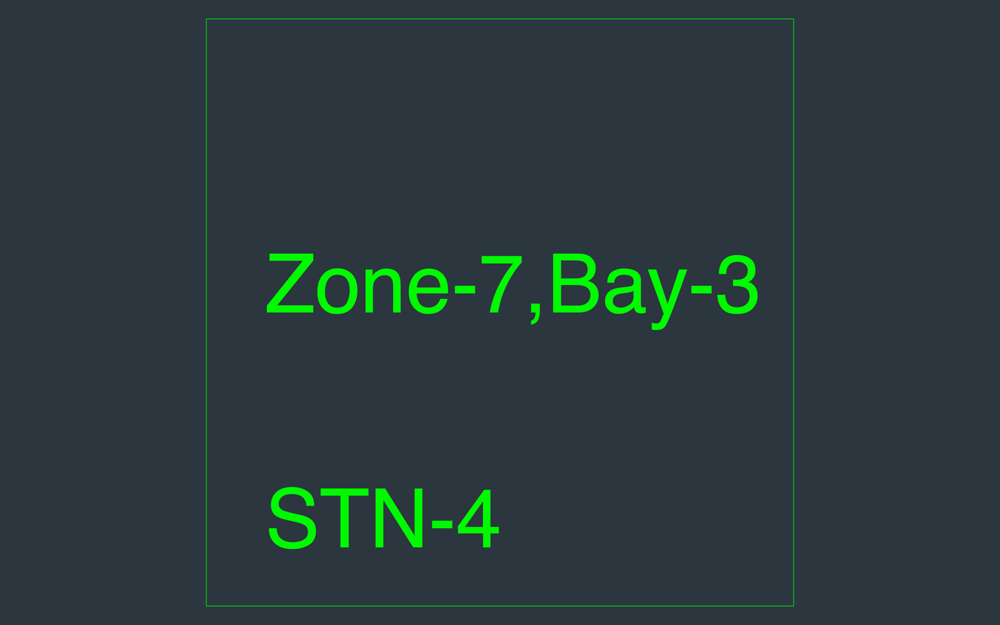
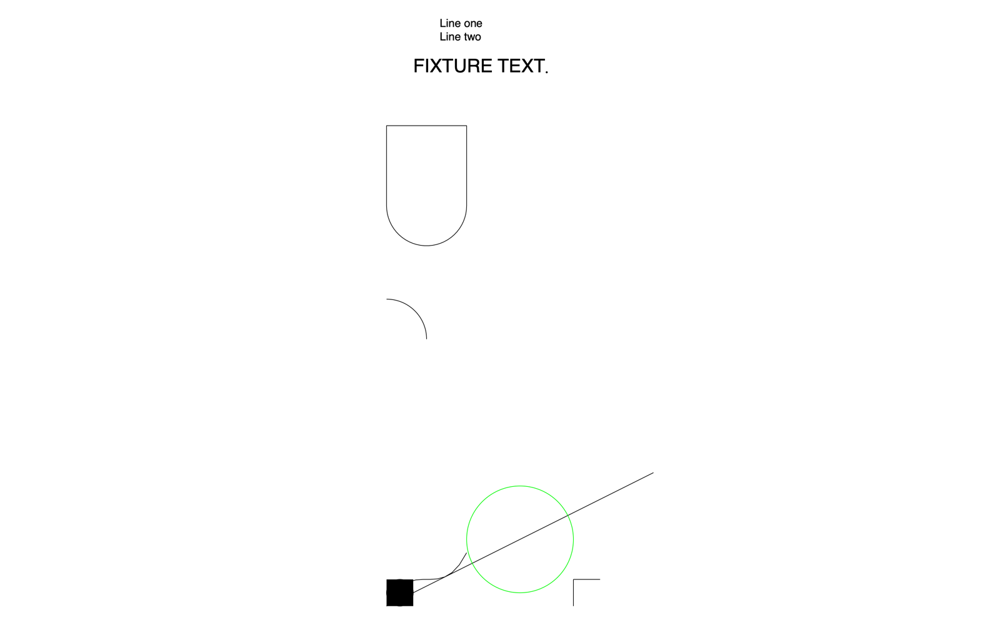
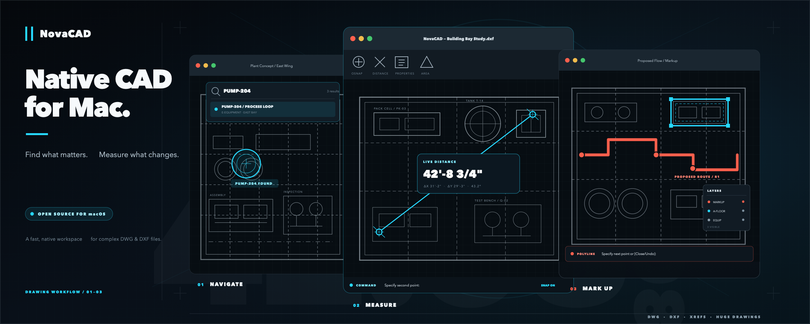
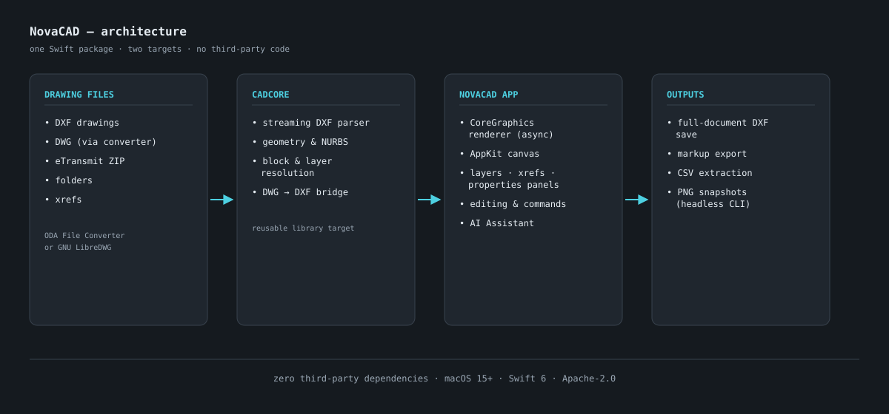

<div align="center">



# NovaCAD

**Native macOS DWG/DXF viewer, markup, and data tooling for technical drawings and plant layouts.**

Written in Swift, with no third-party Swift package dependencies.

[](#requirements)
[](#requirements)
[](LICENSE)
[](#requirements)
[](#building--testing)



</div>

NovaCAD reads DXF natively and opens DWG through a local converter. It supports
large plant layouts with millions of entities. Drawing-review tools include
measurement, markup, block/attribute editing, CSV
data extraction, xref handling, aisle/travel-distance analysis, and an
optional AI Assistant that can call those tools on your drawing.

One Swift package contains `CADCore` and the native macOS app, with the test
suite in the repository. DWG conversion and optional AI backends have the
external requirements described below.

## Screenshots

| Navigate & measure | Zoom detail |
| --- | --- |
|  |  |
| **Block attributes** | **Light theme** |
|  |  |

These are real renders produced by the app's own headless snapshot mode from
the synthetic fixtures in `Tests/Fixtures/` — see
[Headless snapshots](#headless-snapshots) to reproduce them.



## Workspace ergonomics

The full-width ribbon sits above both the layers sidebar and the drawing.
It groups labeled tools into **Home**, **Draw**, **Modify**, **Annotate**,
and **View** tabs. The active tool is highlighted; the chevron collapses the
ribbon to tabs only for more drawing space (**⌥⌘R** also toggles it).
Larger primary icons and bordered buttons make tool targets clear. Less-used
groups collapse into menus when the window narrows. Tabs and collapse state
are remembered.
Save, Undo, Redo, Find, and the File menu share the title bar with the drawing
name; there is no separate app-title row.
Advanced commands remain under **Draw → All tools** and the native menus.
Ribbon tooltips include command aliases such as **L**, **PL**, and **REC**;
the same strings are exposed as accessibility help.

Individual DWGs now use the same persistent conversion cache as drawing
packages. Reopening an unchanged drawing skips ODA entirely. Fresh conversions
launch hidden in the background with Qt activation disabled; a converter version
may still show its own brief splash. The installed ODA application is unchanged.

## What it is

- A **fast viewer** for DXF (and DWG via a free converter), including xrefs,
  eTransmit ZIP packages, and folders of drawings.
- A **markup and review tool**: draw over the drawing, measure distances and
  areas, search every text string, edit blocks and attributes, and export your
  changes as DXF or CSV.
- A **data tool**: extract attributes and block data to CSV, compute
  aisle-routed travel distances, and (optionally) let an AI Assistant run
  those analyses for you.

## What it isn't

NovaCAD is not a full AutoCAD replacement and does not try to be: it writes
DXF (not DWG), exports sheet PDFs without CTB/STB plot styles, and has no LISP, 3D modeling, or
cloud service. See [Known limitations](#known-limitations).

## Requirements

| | |
| --- | --- |
| OS | macOS 15 (Sequoia) or later, Apple Silicon recommended (the packaged `.app`/`.pkg` is arm64) |
| Toolchain | Xcode 16+ / Swift 6.0 (only to build from source) |
| Dependencies | **None** — the package has no third-party dependencies |
| DWG support | Free [ODA File Converter](https://www.opendesign.com/guestfiles/oda_file_converter) (preferred) or GNU LibreDWG (`brew install libredwg`) |

DXF works out of the box. DWG is a proprietary format, so NovaCAD converts it
to DXF once via an external converter and caches the result.

## Quick start

```sh
git clone https://github.com/michaeljabbour/NovaCAD-Mac.git
cd NovaCAD-Mac
swift run -c release NovaCAD      # release builds are recommended for large drawings
```

Then open a drawing with **File ▸ Open** (⌘O) or drag a `.dxf`, `.dwg`,
`.zip` (eTransmit), or folder onto the window. Finder double-click works too
once the app is built/installed.

### DWG files

Install the free ODA File Converter, then run it once from Finder
(right-click → Open) or clear its quarantine flag so it can run headless:

```sh
xattr -dr com.apple.quarantine /Applications/ODAFileConverter.app
```

GNU LibreDWG is supported as a fallback (`brew install libredwg`); it handles
fewer DWG versions and is less faithful than the ODA converter.

## Install as a Mac app

```sh
./Scripts/build_app.sh              # tests, builds, and installs to /Applications
./Scripts/build_pkg.sh              # builds NovaCAD-<version>.pkg for sharing
```

`swift build` and `swift run` alone do not install a Finder application.
The install script registers NovaCAD for `.dwg` and `.dxf` files, so you can
right-click a drawing and choose **Open With → NovaCAD** immediately. DWG
still requires the separate [converter setup](#dwg-files); DXF opens directly.
Self-contained drawings open without scanning their parent folder. NovaCAD
indexes sibling drawings only when it needs to resolve external references.

This repository is the `michaeljabbour/NovaCAD-Mac` fork. Build from this
checkout to get its workspace changes; upstream installers do not contain
changes that have not been merged and released upstream. See
[CHANGELOG.md](CHANGELOG.md) for the fork's 1.6.1 changes.

Upstream prebuilt installers are attached to
[upstream releases](https://github.com/ryandirezze/NovaCAD-Mac/releases/latest).
The build scripts ad-hoc sign the app and create an unsigned installer;
neither artifact is Developer ID signed or notarized. macOS may show an
"unidentified developer" prompt on first install or launch —
resolve it via **System Settings → Privacy & Security → Open Anyway**, or
right-click → Open. The packaged build is Apple Silicon only.

### Upstream Homebrew distribution

```sh
brew install --cask ryandirezze/tap/novacad
```

The [`ryandirezze/tap`](https://github.com/ryandirezze/homebrew-tap) cask
installs the upstream release, not this fork's build. Use the source build
instructions above for the changes documented here.

## Features

### File menu, workspace, and recovery

- **File** is available in the macOS menu bar and inside the window: New Tab,
  Open/Open Recent, Save/Save As, Reload, PDF export, markup export, and recovery.
- Drawings remember their last sheet, zoom, and layer visibility by original
  layer name. **View → Saved views → Save View Preset** stores named views for that drawing.
- **Only layers on this sheet/model** filters the sidebar to the current space.
  Right-click a layer and choose **Zoom to Layer** to find its geometry.
- Changed documents get a background recovery copy after three idle seconds,
  with a 30-second fallback. Closing a tab or quitting also checkpoints edits.
  **File → Recover Unsaved Drawings** opens a copy; the original is untouched.
  Recovery copies persist until the recovered drawing is explicitly saved.
- Save uses an atomic replacement after writing a complete DXF. DWG inputs
  still require Save As to DXF. Recovery errors appear in the status bar.

### View & navigate

- Renders LINE, CIRCLE, ARC, LWPOLYLINE (with bulges), POLYLINE (2D/3D,
  polyface meshes), SPLINE (true NURBS), ELLIPSE, SOLID, TRACE, 3DFACE, POINT,
  HATCH, TEXT, MTEXT, ATTRIB, INSERT (incl. arrays), DIMENSION, LEADER,
  ACAD_TABLE, with the full ACI palette + true color, linetypes, hatches,
  lineweights, and dark or light canvas themes.
- **Search (⌘F)**: Spotlight-style search over every text string, label,
  attribute, and block name — including resolved xref content — with
  pan/zoom animation to each hit.
- Quality control (1–5) balances detail vs. redraw speed on dense drawings.
  Initial fitting uses robust extents; **Fit Drawing (⌘0)** includes all
  rendered content, including text and title blocks, on its first click.
- Multi-document tabs and trackpad gestures (pan, pinch-zoom, Option+scroll).

### Layers, xrefs & properties

- **Layers panel** — show/hide (freeze/thaw), lock/unlock, color swatches,
  entity counts, and search in original names or local English aliases for
  common Russian CAD terms. Select multiple rows to show, hide, or isolate
  them together; Restore returns to the visibility state before isolation.
  Common Russian names receive automatic English display aliases in block
  pickers, properties, and search; originals remain available on hover.
  There is no language switch on the canvas. Display aliases do not translate
  or rename the file itself.
- **Paper sheets** — choose one named layout from the Sheet menu beneath the ribbon,
  or step through sheets with Previous/Next; other sheets stay separate and are retained when saving.
  The empty External References panel no longer takes space from the layers.
- **External References pane** — show/hide each xref, flag unresolved ones,
  attach new xrefs, re-point missing xref paths, and open an xref in a new
  tab (auto-reloads when saved).
- **Properties panel** — type, layer, color, linetype, lineweight, geometry
  details, plus editing of layer/color/linetype/lineweight; fill/hatch and
  dimension-format controls where applicable.
- Selection supports click-to-accumulate (AutoCAD PICKADD), Shift to remove,
  Window/Crossing (drag direction), Option-drag Lasso, and Fence, with grip
  editing on selected objects.

### Draw, edit & markup

- Drawing tools: Line, Polyline, Circle, 3-point Arc, Rectangle, Polygon,
  Ellipse, Spline, Point, 3D Face, Text, plus linear/aligned dimensions,
  region-from-boundary, and hatch fill — with **OSNAP** (endpoint, midpoint,
  center, intersection, perpendicular, tangent) and typed coordinate input
  (`100,50`, `@25,0`, length-along-cursor).
- Modify toolset: Move, Copy, Rotate, Scale, Mirror, **Trim, Extend, Fillet,
  Chamfer, Offset, Stretch, Array, Explode, Join**, Erase/Delete — all
  undoable (⌘Z / ⇧⌘Z), and cross-document copy/paste.
- Markup layer: classic draw tools place markup on a `NOVACAD-MARKUP` layer
  in a pickable color so proposed changes read clearly against the original
  drawing.
- **Command palette** at the bottom: type `L`, `PL`, `C`, `A`, `REC`, `POL`,
  `T`, `E`, `DI`, `AA`, `TR`, `EX`, `F`, `O`, `AR`, `X`, `J`, `Z`, `U`, …,
  with interactive "Select objects:" prompts (`W`/`C`/`F`, `ALL`, `P`, `L`).
- Block tools: insert blocks (true INSERT entities), stamp an existing block
  by picking it, and edit block attributes in a dedicated editor
  (ATTDEF/ATTEDIT).

### Save & export

- **Export Sheets to PDF** creates one vector page per selected sheet (or Model),
  with linked raster images, drawing colors, layer/entity lineweights, and current
  layer visibility. Choose drawing paper sizes or A4/A3/Letter/Tabloid/ARCH D,
  drawing page setup, 1:1/1:50/1:100, or explicit Fit to page. Actual scales may
  crop out-of-page content; export reports this. CTB/STB styles are not applied.
  The export selector retains all stored layouts, including empty layouts
  omitted from on-screen sheet navigation.


- **Save (⌘S) / Save As (⇧⌘S)** write the full live document — every
  in-session edit, including modified or deleted original entities — back to
  DXF via the structural writer. Documents opened from DWG save as DXF.
- **Export Markup as DXF…** produces a standalone markup file you can attach
  as an xref over the master drawing.
- **Save Copy with Markup…** writes a byte-faithful copy of the original DXF
  with the markup merged in.
- **Data Extraction** exports attributes/block data to CSV and imports edits
  back from CSV, with a column picker.

> Note: the two *markup* exporters cover the primitive markup set. Block
> stamps and hatch markup are fully preserved by Save/Save As, but may be
> omitted from Export Markup / Save Copy, and stamped blocks are not restored
> by Reload.

### AI Assistant (optional)

The **AI Assistant** tab in the shared **Properties & AI** sidebar can answer
questions about the open drawing and,
on supported backends, call 18 built-in drawing tools (read entities,
extract attributes, propose attribute edits, analyze/repair aisle networks,
route travel distances, shade aisle/dock areas, export CSVs, and more).
Edits and geometry are **staged for your review** — nothing is applied to the
drawing until you click Apply. The assistant is docked in this sidebar; the
previous floating mode has been removed. View → AI Assistant opens the AI tab
or closes it when it is already visible.

Replies render Markdown emphasis, headings, lists, links and code. The assistant
receives the active space/sheet and coordinate units. `read_drawing` gives a compact
overview; `query_entities` searches text, blocks and requested geometry types in bounded pages and can inspect
another paper sheet by name without changing your view. Block lists are paged too.
Tool responses have a 16 KiB ceiling. The Anthropic loop keeps requests below
128 KiB by removing older complete tool exchanges, while recent chat context is
bounded separately; the visible conversation stays intact. Other backends retain
their own context-window policies.

The assistant also receives the live canvas bounds and nearby text.
`visibleOnly: true` queries follow pan, zoom, sheet changes and hidden layers,
including nearby line/arc/polyline geometry. This is drawing data, not screenshot
vision; bounds intersection can include objects only partly on screen. Paper coordinates may be scaled, so the assistant
must confirm scale and endpoints before claiming a real-world distance.

| Provider | API | Tool-calling |
| --- | --- | --- |
| Anthropic | Messages API | ✅ |
| OpenAI-compatible | Chat Completions | Chat only |
| OpenCode CLI | one-shot `opencode run` | Chat only |
| OpenCode server (agentic) | local `opencode serve` | ✅ |

The OpenCode server backend additionally needs the `opencode` CLI and
`npm install @opencode-ai/plugin` in its workspace (the app tells you if it's
missing and runs text-only otherwise). **Privacy:** when you enable the AI
Assistant, drawing content (entity summaries, attributes, computed values) is
sent to the provider you configure.

### Headless snapshots

Render a PNG without opening the UI — useful for scripting and batch
previews:

```sh
.build/release/NovaCAD --snapshot out.png [--size WxH] [--space paper] [--light] \
    [--focus x,y,w,h] [--select x,y] [--quality 1-5] <drawing.dxf|.dwg|.zip|folder>
```

`--focus` zooms to a world-coordinate rectangle; `--select` hit-tests a world
point and renders it highlighted; `--debug-bounds` prints culling statistics.
PNG output is rendered at 2× the requested `--size` for crisp README/social
images. Additional flags (`--exec`, `--compare`, `--roundtrip`, …) exist for
automation and the project's own verification harnesses.

Export all paper layouts headlessly (add `--layout "Sheet name"` for one):

```sh
.build/release/NovaCAD --export-pdf sheets.pdf --pdf-fit drawing.dwg
```

Use `--layout "A-104. Furniture Arrangement"` to render a specific named
paper sheet. This selects paper space and the editable renderer automatically.

### Workspace navigation and rendering

Search lives above the canvas and frames each match at 28% of the available view,
with its surroundings visible. Closing search restores the prior view. Each sheet
and Model space remembers its own zoom and center. Empty layouts (including layouts
with only the default paper viewport) stay in the file but are omitted from sheet
counts and Previous/Next navigation.

Units, Quality, Drawing Info, and Issues open beside their buttons inside the
workspace, above the status bar. Inspector content scrolls when a small window
cannot fit the full card. Properties and AI Assistant share a single
sidebar with two tabs; the last selected tab is remembered. A fitted drawing
re-fits when panels open or close; manual zoom and pan remain unchanged. Layer
visibility, lock and color controls, Clear Selection, sheet/search arrows and
workspace inspector/search/sidebar close buttons use 28-point targets.
The ribbon toggle has a 30-point target,
and layer rows expose a default accessibility selection action.

MTEXT respects its reference width, and Fit Drawing includes full rotated text
bounds. Paper-only files with empty Model space no longer show unused block
schedules as overlapping model geometry; the unused definitions remain in the
file. Legacy orphan-block recovery remains available for model exports and xrefs.
Mixed coordinate and annotation units are explained in Issues and Units & Format;
annotation labels never change the measurement scale.


## Xrefs & eTransmit

- Open an eTransmit ZIP directly: it's extracted, the main drawing is
  detected, and nested xrefs resolve from the package.
- Open a folder of drawings or a single file; xrefs resolve from sibling
  files, with `XREFNAME|layer` entries in the Layers panel.
- Missing xrefs are flagged; you can re-point them or bind xrefs in AutoCAD
  before export.

## Performance

NovaCAD is built for large industrial drawings: a byte-level streaming DXF
parser (no full-file string conversion) feeds an asynchronous, coalescing
CoreGraphics render pipeline with render-time level-of-detail, so geometry is
decimated to screen resolution and sub-pixel entities collapse to
deduplicated ticks. Pan/zoom stays responsive on multi-million-entity
drawings.

Rather than quoting benchmark numbers, measure on your own hardware — the
headless snapshot CLI prints parse and render timings:

```sh
.build/release/NovaCAD --snapshot /tmp/out.png your-drawing.dxf
```

## Architecture



Two targets, one package: **CADCore** (streaming DXF parser, geometry/NURBS,
block and layer resolution, DWG→DXF bridge) is a self-contained library;
**DWGViewer** is the macOS app (renderer, canvas, panels, editing, command
palette, AI Assistant). The headless snapshot mode uses the same pipeline the
UI does.

## Building & testing

```sh
swift build                 # compile
swift test                  # 1,200+ XCTest cases
swift run -c release NovaCAD
./Scripts/build_app.sh      # release .app → /Applications
./Scripts/build_pkg.sh      # distributable .pkg
```

Test fixtures are small synthetic DXF files under `Tests/Fixtures/`; tests
that exercise very large real-world drawings look for them via
`NOVACAD_SAMPLE_LAYOUT` and skip when it isn't set.

## Project structure

```
Sources/
├── CADCore/               # parser + geometry library (no UI, no AppKit)
│   ├── DXFParser.swift         # byte-level streaming DXF reader
│   ├── DXFModel.swift          # document model: layers, linetypes, xrefs
│   ├── Geometry/               # curves, splines, offsets, intersections
│   └── DWGConverter.swift      # DWG → DXF via ODA / LibreDWG
├── DWGViewer/             # the macOS app
│   ├── DWGViewerApp.swift      # entry point (+ headless snapshot hook)
│   ├── ContentView.swift       # toolbar, panels, canvas hosting
│   ├── DXFCanvasView.swift     # AppKit canvas: input + frame blitting
│   ├── DXFRenderer.swift       # async bitmap rasterizer
│   ├── Editing/                # trim, fillet, offset, array, stretch, …
│   ├── Commands/               # command registry + headless harness
│   └── AI/                     # optional AI Assistant backends + tools
Tests/DWGViewerTests/      # XCTest suite; synthetic drawings live in Tests/Fixtures
Scripts/                   # build_app.sh, build_pkg.sh, icon generator
```

## Use CADCore in your project

CADCore — the streaming DXF parser and 2D geometry library — is published as
a library product of this package, so other Swift projects can reuse it:

```swift
// Package.swift
dependencies: [
    .package(url: "https://github.com/ryandirezze/NovaCAD-Mac.git", from: "1.2.3"),
],
targets: [
    .target(
        name: "YourTarget",
        dependencies: [
            .product(name: "CADCore", package: "NovaCAD-Mac"),
        ]
    ),
]
```

```swift
import CADCore

let document = try DXFParser.parse(url: drawingURL)
print(document.layers.count, document.unitsLabel)
```

Requires macOS 15+ and adds no further dependencies.

## Known limitations

- Writes **DXF only** — native DWG writing requires the licensed ODA SDK.
- PDF sheet export is supported; native printer dialogs and CTB/STB plot styles
  are not. No LISP, 3D modeling, or orbit views.
- Paper viewports support top-down orthographic 2D views, scale/twist/target,
  frozen layers, and rectangular or straight-polyline/circle clipping. Viewport
  model content is display-only in Paper; switch to Model to edit it. Perspective,
  3D/depth clipping, and curved-polyline clipping are reported as unsupported.
- Local linked raster images support placement, clipping, and fade. Missing images
  have placeholders and can be located through **Issues → Locate Images Folder**.
  Brightness/contrast overrides are reported but not applied. WIPEOUT and OLE
  objects remain unsupported and are now reported in the Issues panel.
- Sheet layer counts refer to rendered geometry. Viewport counts use intersections
  with the viewport rectangle; nonrectangular clipping can make these approximate.
- `Export Markup as DXF` / `Save Copy with Markup` cover the primitive markup
  set (see the note under Save & export).
- The AI Assistant is optional and requires your own provider/credentials;
  tool-calling needs the Anthropic or OpenCode server backend.
- The packaged app is ad-hoc signed (Gatekeeper prompt on first run) and
  Apple Silicon only.
- DXF is a large format: uncommon entities render as their nearest
  supported representation or are skipped with diagnostics.

## Contributing

Contributions are welcome — see [CONTRIBUTING.md](CONTRIBUTING.md). Bug
reports are most useful with a minimal repro and (if possible) a small
synthetic DXF; please never attach real or proprietary drawings.

## License & trademarks

Apache-2.0 — see [LICENSE](LICENSE) and [NOTICE](NOTICE).

NovaCAD is an independent project and is not affiliated with, endorsed by, or
sponsored by Autodesk, Inc. AutoCAD and DWG are trademarks of Autodesk, Inc.
ODA File Converter is a product of the Open Design Alliance. Apple and macOS
are trademarks of Apple Inc. All other trademarks are the property of their
respective owners.
